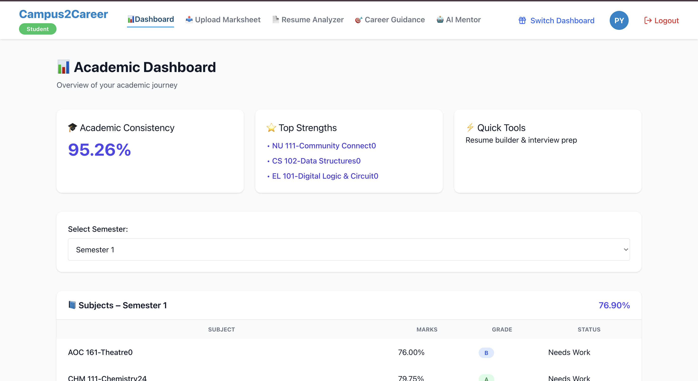
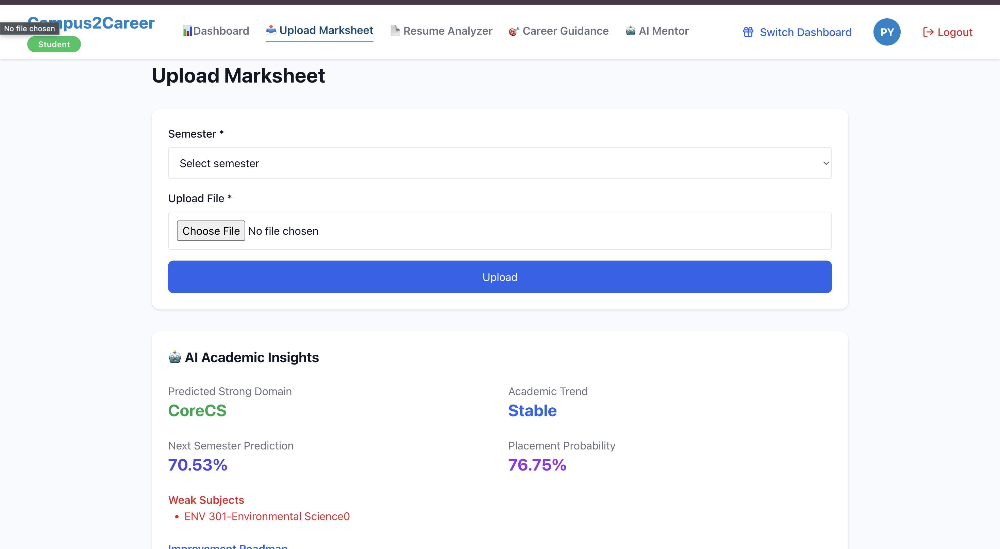
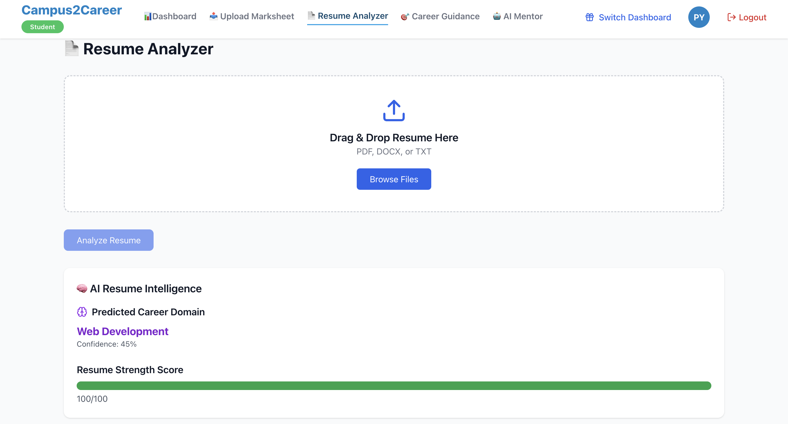
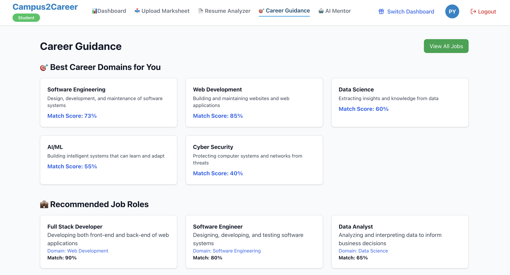
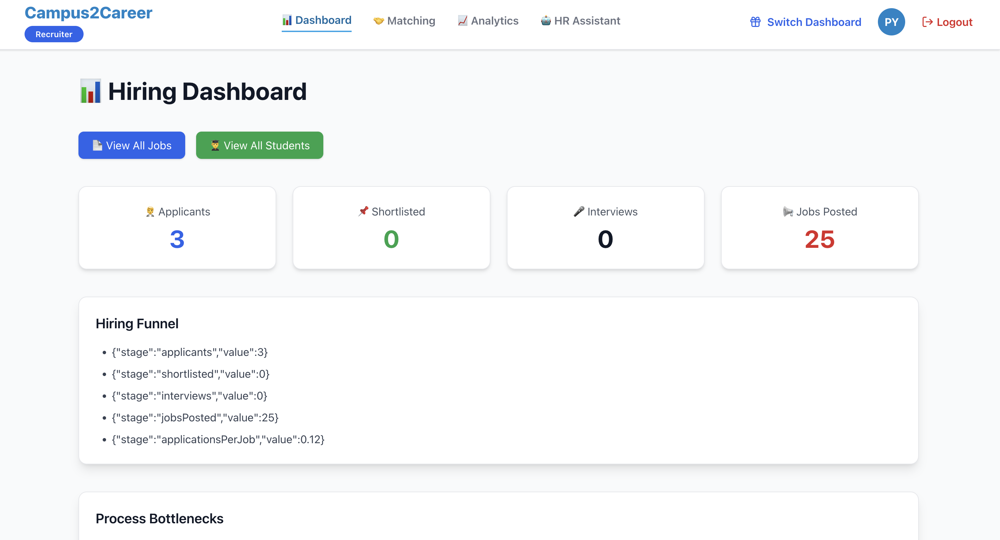
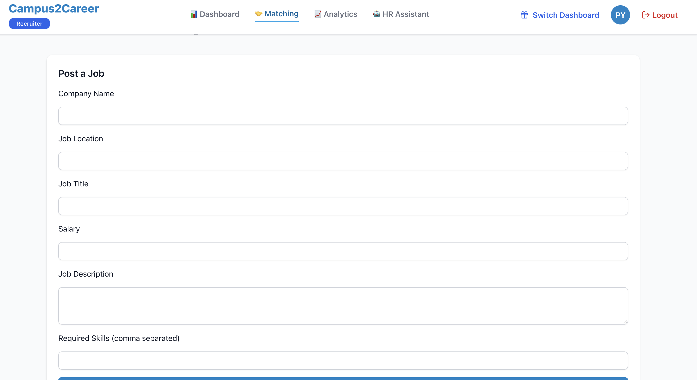
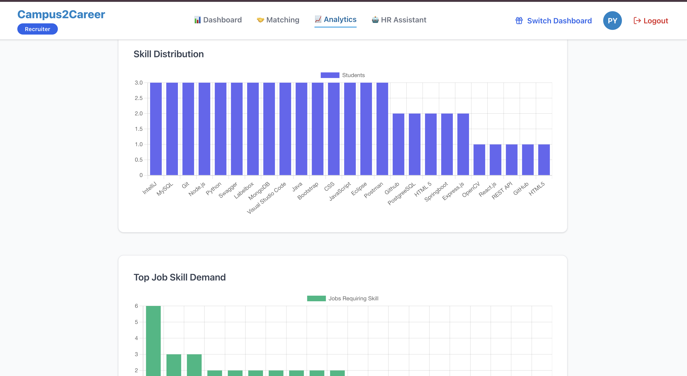
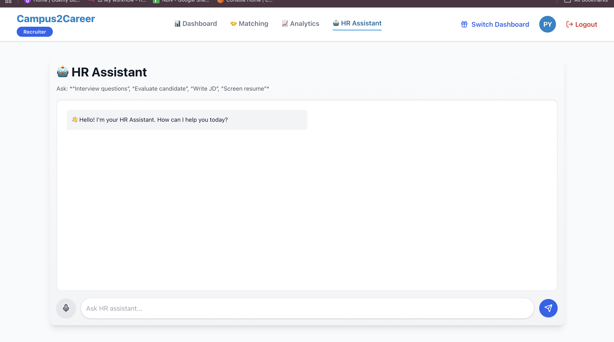
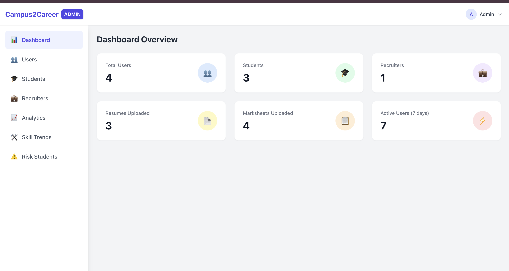
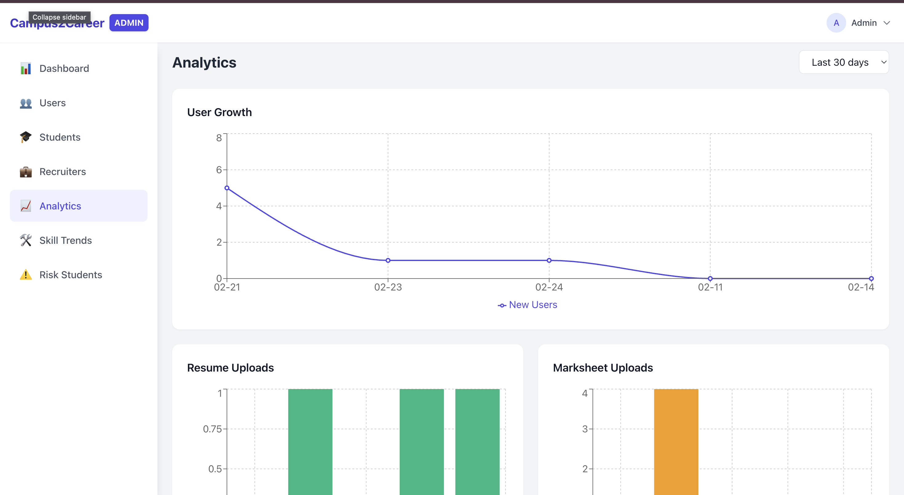

 # 🎓 Campus2Career – AI-Powered Academic & Recruitment Platform

Campus2Career is a **full-stack AI-driven platform that bridges students, recruiters, and administrators** into a single intelligent ecosystem.
It analyzes student marksheets, predicts performance, guides career choices, assists in resume building, and empowers recruiters with AI-powered candidate insights.

This is a complete **Academic + Recruitment + AI platform built using the MERN Stack + Groq Llama 3.3 + Custom ML models**

---

# 📌 Purpose of the Project

The platform is designed to:
- Analyze student marksheets using AI
- Predict academic performance & career domain
- Assist students in resume building and career planning
- Allow recruiters to post jobs and see AI-ranked students
- Provide admins with complete platform analytics
The result is a smart, automated, and scalable academic + recruitment solution.

---

## Tech Stack
**Frontend**


**Backend**


**Database**


**AI/ML**


---

# #✨ Features
# 🧑‍🎓 Student Module
- AI-based marksheet parsing (PDF/DOCX → structured data)
- Predicts:
    - Strong domain
    - Weak subjects
    - Academic trend
    - Next-semester percentage
    - Placement probability
- Smart Resume Builder with missing-skill detection
- Personalized higher-studies guidance & improvement roadmap

# 🧑‍💼 Recruiter Module

- Job posting with skill & domain selection
- AI-ranked student recommendations
- Recruiter analytics dashboard
- HR assistant powered by AI

# 🛡 Admin Module
- Monitor students & recruiters
- Platform insights & analytics
- AI recommendations for platform growth

# 🤖 AI Chatbot
- Groq + Llama 3.3 real-time chatbot
- Answers academic, resume, and career-related queries
- Uses student data for personalized responses#

---

## 🏗️ Architecture

- **Frontend (React + Vite + TailwindCSS)**
Dashboards, file uploads, resume UI, chatbot, analytics charts.

- **Backend (Node.js + Express)**
File parsing, AI integration, marksheet processing, ML predictions, job portal, admin logic.

- **Database (MongoDB)**
Students, recruiters, marksheets, jobs, AI insights, resumes.

- **AI Layer**
Groq Llama 3.3 for LLM reasoning, ML models for academic prediction, resume evaluation engine.

---

🏗️ Architecture

Campus2Career uses a modular, AI-first architecture:

Frontend (React + Vite + TailwindCSS)
Dashboards, file uploads, resume UI, chatbot, analytics charts.

Backend (Node.js + Express)
File parsing, AI integration, marksheet processing, ML predictions, job portal, admin logic.

Database (MongoDB)
Students, recruiters, marksheets, jobs, AI insights, resumes.

AI Layer
Groq Llama 3.3 for LLM reasoning, ML models for academic prediction, resume evaluation engine.

---

## How It Works
- Student uploads marksheet (PDF / DOCX).
- Backend extracts text using pdf-parse / mammoth.
- AI parses and structures marksheet data.
- ML models compute:
    - Domain prediction
    - Weak subjects
    - Improvement roadmap
    - Next-semester prediction
- Recruiters see AI-ranked candidates for each job.
- AI chatbot provides personalized guidance.

---
### Run Project

# Backend 
```bash
cd backend
# Install dependencies
npm install
# Create environment file
touch .env.local
# Add API URL to .env.local
echo "VITE_API_URL=http://localhost:5000" > .env.local
# Start development server
npm run dev
```
# Frontend

```bash
cd frontend
# Install dependencies
npm install
# Start development server
npm run dev

Then open : `http://localhost:5000` 
```

---


<hr style="border: 1px solid white; margin-top: 20px;">

<h1 style="color:#1E90FF;">UI Screenshots</h1>

<h3 style="color:#1E90FF;">Student Dashboard</h3>


<h3 style="color:#1E90FF;"> Upload Marksheet</h3>


<h3 style="color:#1E90FF;">Resume Analyzer</h3>


<h3 style="color:#1E90FF;">Career</h3>


<h3 style="color:#1E90FF;">Recruiter Dashboard</h3>


<h3 style="color:#1E90FF;">Jobs</h3>


<h3 style="color:#1E90FF;">Recruiter Analytics</h3>


<h3 style="color:#1E90FF;">Assistance</h3>


<h3 style="color:#1E90FF;">Admin Dashboard</h3>


<h3 style="color:#1E90FF;">User Management</h3>


<h3 style="color:#1E90FF;">Admin Analytics</h3>

